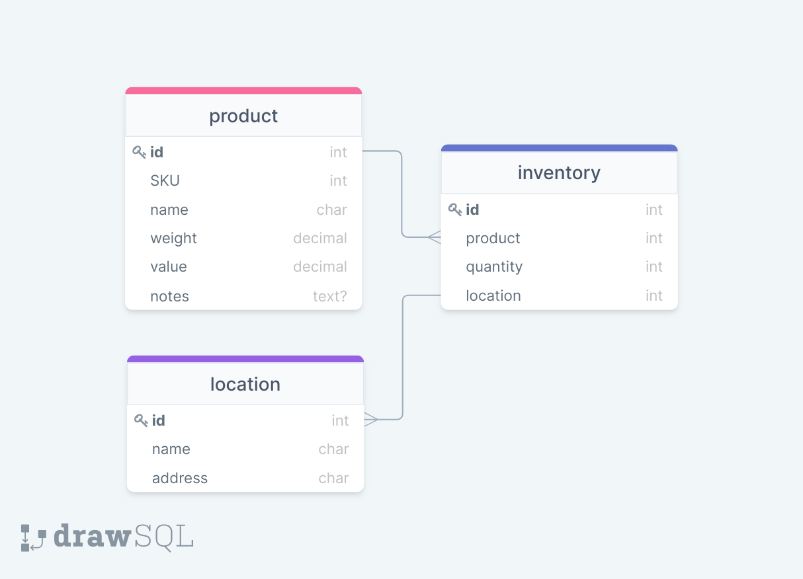

# Logistics Company Inventory Management App #
Fall 2022 - Shopify Developer Intern Challenge Submission. An inventory tracking application for a logistics company. A web application that meets the requirements listed below, along with one additional feature, with the options also listed below.

## Contents ##
- [Requirements](#requirements)
- [Structure](#structure)
- [Features](#features)
    - [Current Features](#current-features)
    - [Potential Future Features](#future-features)
- [Technologies](#technologies)

## Requirements ##
- Basic CRUD Functionality. You should be able to:
    - Create inventory items
    - Edit Them
    - Delete Them
    - View a list of them

- ONLY ONE OF THE FOLLOWING _(We will only evaluate the first feature chosen, so please only choose one)_
    - When deleting, allow deletion comments and undeletion
    - Ability to create warehouses/locations and assign inventory to specific locations
    - Ability to create “shipments” and assign inventory to the shipment, and adjust inventory appropriately

- Authentication and CSS/Design are not required and will not be considered during evaluation.

**Chosen Additional feature:** Ability to create warehouses/locations and assign inventory to specific locations

## Structure ##

Database Diagrams

****

|   | Product Model  |   |
|---|---|---|
| id  | IntegerField  | OnetoMany(Inventory) |
| SKU  | IntegerField  |   |
| name | CharField  |  |
| weight  | DecimalField  |   |
| value  | DecimalField  |   |
| notes  | textField  |   |

**Product Model:** Stores info on each product type

****

|   | Inventory Model  |   |
|---|---|---|
| id  | IntegerField  |  |
| product  | ForeignKey  | ManytoOne(Products) |
| quantity | IntegerField  |  |
| location  | ForeignKey  | ManytoOne(Locations)  |

**Inventory Model:** Links Products to locations, stores amount of each product at a given location allowing for each product stock to be split between locations

****

|   | Location Model  |   |
|---|---|---|
| id  | IntegerField  | OnetoMany(Inventory) |
| name  | CharField  |  |
| address | CharField  |  |

**Location Model:** Stores name and address of each location.

## Features ##

### Current Features ###

- List view of products - A table view of all products in system displaying their details as well as their inventory count at each location where there is inventory.
- Add/Update Products - New products can be added and updated.
- Add/Subtract inventory - Inventory amounts for each location can be increased and decreased.
- Delete Products - Products can be deleted after confirming pop up. This also deletes inventory associated with the product.
- Add locations - New locations can be added.
- Edit locations - Location details can be edited.
- Delete locations - Locations can be deleted which also removes inventory at that location but not products as they can be linked to multiple locations.

### Potential Future Features ###

- Add inventory to multiple locations when adding new product.
- Authentication with different user levels allowing different permissions - Some user levels can edit details and inventory but not delete/add products/locations. This allows basic staff to manage day to day while major changes have to be done by specific staff.
- Quick remove single item from inventory for when a shipment is made

## Technologies ##

### Languages ###
- Python
- HTML
- CSS

### Frameworks/Libraries ###
- Django
- Bootstrap
- JQuery
- Crispy Forms